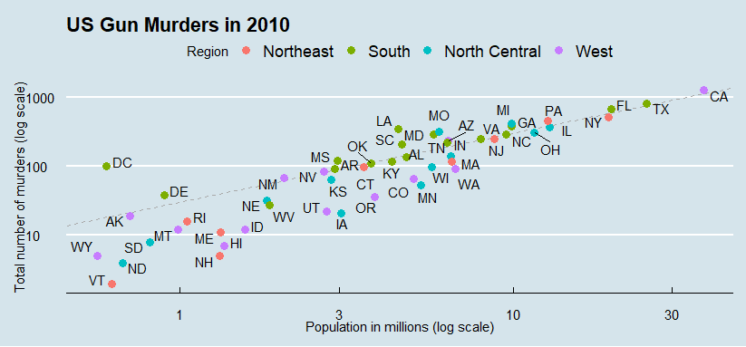
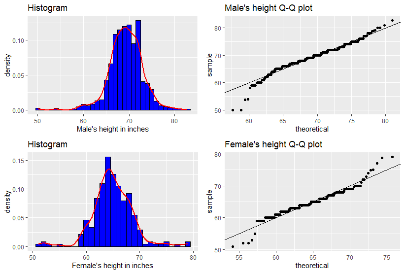
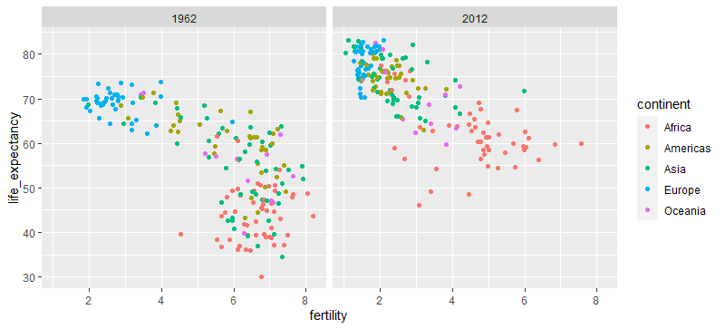

# Data Visualisation using R

## Introduction
This section is intended to answer some questions related to different economic and social topics.
We possess different data with the intention of analysing it, manipulating it, and drawing some meaningful graphs, in order to make observations that will help us find the correct answers, and depict some myths in order to find the truth.
all the data used are open source and free to use.

## Sections
1. ### US Gun Murders 2010
    1. How do states vary across population size and total number of murders?
    2. Is there any relationship between murders totals and population size?
    3. how are different regions classified with respect to the average murder rate?

2. ### Height analysis
    1. does the height mesurement of males and females follow a certain distribution?
    2. how to prove the answer of the preceding question?

3. ### Life expectency vs fertility rate 
    1. myth : the world is divided into two groups, the Western World, composed of western europe and north america, which is characterized by long lifespans and small families versus the developing world, Africa, Asia, and Latin America, characterized by short lifespans and large families.

## Result

1. ### US Gun Murders
    1. Most of the states in the west region have low population size, other regions are spread across the scale
    2. There is a positive linear relationship between population size and the murders totals
    3. Most states located in south region have murder rates above the average (which are shown by the points above the dashed line).

2. ### Height Analysis
    1. Males height distribution follows the normal distribution. contrary to the female's that shows two modes instead of one
    2. This is proven by the fact that the point of the Q-Q plot lie on the line of slope 1 and intercept 0 for the male's data, while the female's data are shifted upward along the higher quantiles. The female's result doesn't match the expectation, the reason could be an error in the sampling phase.

    
3. ### Life expectency vs fertility rate
    1. the graph clearly shows that the previous statement holds in the past but the circumstances are changing, and no longer holds in the present time. which proven by the fact that most asian and african countries are shifting to the top left of the graph which is the region of low fertility rate and high life expectency.