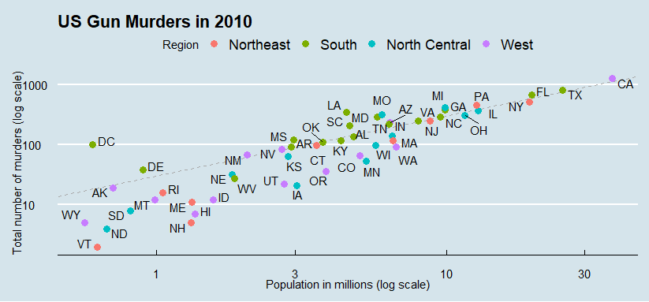
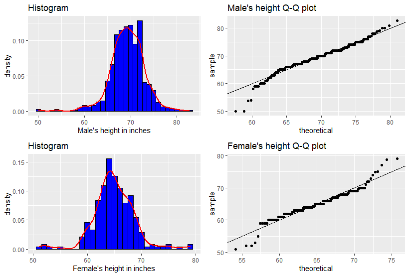
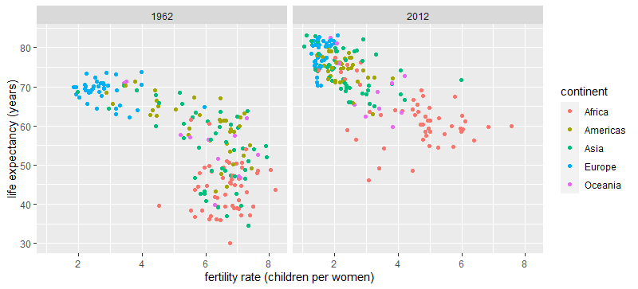
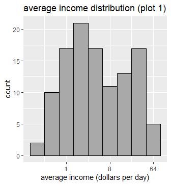
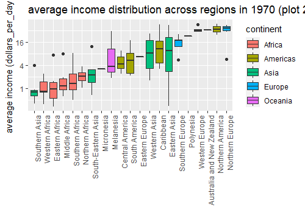
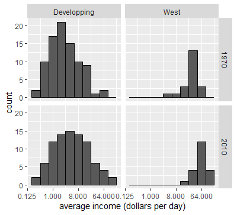
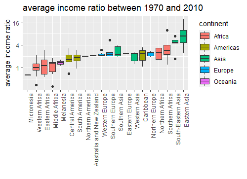

# Data Visualisation using R

## Introduction
This section is intended to answer some questions related to different economic and social topics.
We possess different data with the intention of analysing it, manipulating it, and drawing some meaningful graphs, in order to make observations that will help us find the correct answers, and depict some myths in order to find the truth.
all the data used are open source and free to use.

## Sections
1. ### US Gun Murders 2010
    1. How do states vary across population size and total number of murders?
    2. Is there any relationship between murders totals and population size?
    3. how are different regions classified with respect to the average murder rate?

2. ### Height analysis
    1. does the height mesurement of males and females follow a certain distribution?
    2. how to prove the answer of the preceding question?

3. ### Life expectency vs fertility rate  
    Myth : the world is divided into two groups, the Western World, composed of western europe and north america, which is characterized by long lifespans and small families versus the developing world, Africa, Asia, and Latin America, characterized by short lifespans and large families.

4. ### Rich countries vs poor countries  
    Myth : poor countries have become poorer and rich countries have become richer.  
    In order to check the validity of the previous statement, we will proceed by processing the gdp of countries to answer several intermediate questions. (gdp numbers are adjusted across the years for inflation)
    1. what is the average income distribution across countries in 1970?
    2. what countries were considered rich? and what countries were considered poor?
    3. how has the average income varied across time?
    4. what countries have improved the most? what countries have improved the least?
    5. is the previous statement correct or false?
## Result

1. ### US Gun Murders
    1. Most of the states in the west region have low population size, other regions are spread across the scale
    2. There is a positive linear relationship between population size and the murders totals
    3. Most states located in south region have murder rates above the average (which are shown by the points above the dashed line).

2. ### Height Analysis
    1. Males height distribution follows the normal distribution. contrary to the female's that shows two modes instead of one
    2. This is proven by the fact that the point of the Q-Q plot lie on the line of slope 1 and intercept 0 for the male's data, while the female's data are shifted upward along the higher quantiles. The female's result doesn't match the expectation, the reason could be an error in the sampling phase.

    
3. ### Life expectency vs fertility rate
    1. the graph clearly shows that the previous statement holds in the past but the circumstances are changing, and no longer holds in the present time. which proven by the fact that most asian and african countries are shifting to the top left of the graph which is the region of low fertility rate and high life expectency.

   

4. ### Rich countries vs poor countries
    1. the first histogram shows that a bimodal distriubiton of the average income across country, with the first mode at around 2$ and the second mode at 32$, which indicate indeed the presence of distinct rich and poor countries in 1970.
    2. we can determine the rich and poor country by examining the plot 2, rich countries are concentrated in europe, north america, australia and new zealand (having a median above 32$), while the poor countries makes up the rest of the world.
    3. by looking at the plot 3 we can see a shift toward to the right (increase in average income) for both west and developing countries by 2010, although the shift is larger, concern more developing countries than the west.
    4.the plot 4 shows the ratio of average income between 1970 and 2010, sorted to right from the highest to lowest. We can deduce that asian and some african countries have made more improvement toward their average income than the rich countries denoted by the west (Europe, north Amerca, Australia and New Zealand).
    5. we can conclude from the preceding observation that although rich countries have improved and became richer, developing countries have made even more efforts to their improvement that could be considered even greater than the west countries.
